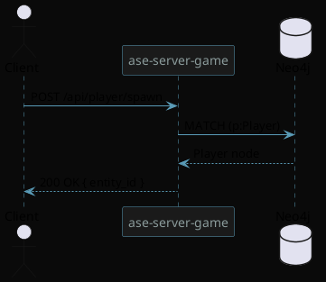
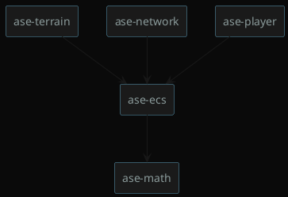

# PlantUML Block — Renderer Demo

Inline-Markdown mit eingebettetem PlantUML-DSL-Block. Der Viewer
soll diesen Block als Diagramm rendern (SVG via `plantuml -tsvg -pipe`),
analog zum bestehenden Mermaid-Renderer (`vwr_rndr_mmrd.cpp`).

## Sequence Diagram

## Component Diagram

